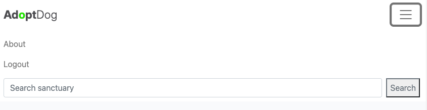

  # ADOPTDOG PROJECT https://www.adoptdog.co.uk
  
  # Contents 
  
  - [ADOPTDOG PROJECT https://www.adoptdog.co.uk](#adoptdog-project-https---wwwadoptdogcouk)
- [Contents](#contents)
  * [1. OVERVIEW](#1-overview)
  * [2. USER STORIES](#2-user-stories)
  * [3. SITE OWNER GOALS](#3-site-owner-goals)
  * [4. FEATURES](#4-features)
  * [5. UX/UI](#5-ux-ui)
    + [AdoptDog CSS Colours](#adoptdog-css-colours)
  * [User Experience Design](#user-experience-design)
  * [6. WIREFRAMES](#6-wireframes)
    * [AdoptDog Landing Page](#adoptdog-landing-page)
    * [AdoptDog Selection-view](#adoptdog-selection-view)
    * [AdoptDog Registration](#adoptdog-registration)
    * [AdoptDog Search](#adoptdog-search)
  * [7. ENTITY RELATIONSHIP DIAGRAMS](#7-entity-relationship-diagrams)
    * [Full Entity relationship Diagram of Django Models](#full-entity-relationship-diagram-of-django-models)
    * [AdoptDog Draw.io Entity Relationship Diagram V1.6](#adoptdog-drawio-entity-relationship-diagram-v16)
  * [8. TESTING](#8-testing)
  * [9. DEPLOYMENT](#9-deployment)
    * [Database](#database)
    * [Deploying to Heroku](#deploying-to-heroku)
  * [10. TECHNOLOGIES](#10-technologies)
    * [Software](#software)
  * [11. MEDIA](#11-media)
  * [12. FUTURE FEATURES](#12-future-features)
- [END OF README.md](#end-of-readmemd)

<small><i><a href='http://ecotrust-canada.github.io/markdown-toc/'>Table of contents generated with markdown-toc</a></i></small>

## 1. OVERVIEW

Twenty thousand dogs are euthanized a year in the UK,  the majority of these dogs are unwanted pets that have ended up in a dog sanctuary,  Due to this complete waste of animal life, I decided to create https://www.adoptdog.com.  This site will try to address this problem by having the functionality to show pictures of dogs that are in sanctuaries.  So I can give details of where they are being kept,  at first for the Berkshire area, and if the site goes viral throughout the UK.  This site will give the ability for a user to see a picture of a dog and add a comment , find contact details, search for a sanctuary and navigate through to a dog that is housed there, and leave a message for the administrators of this site.

This site will for the duration of the project hold fictitious sanctuaries and dogs until the project is marked,  potentially after the marking the site can be populated with real data.

I hope to actively help in finding dogs new homes where they can become part of a new family.  As through no fault of their own, if they do not gain new owners the dogs will be destroyed. 

******

### Target Audience

adoptdog.co.uk aim is to provide information on dogs that have not got homes, for the following criteria,

- Stray Dogs that have been picked up by services such as the RSPCA
- Unwanted pets that have been given to a sanctuary
- Dogs that have not got on with there before family and have been sent to a sanctuary
- Dogs that have been sent to a sanctuary for financial reasons

- The audience is families that are looking to get a new pet dog that are willing to try a sanctuary first before going
to a pet shop,  authorised breeder etc.

- Single adults looking to get a pet dog who can't afford breeders fees for purchase
- For professional services looking to acquire a dog 

The site can be used for 
a). Sanctuaries looking to add their sanctuary and dogs that they currently have for a wider audience on the internet, basically to make a connection to the WebP large image of the animal to a new owner.

b). Families or singletons interested in finding a home for a pet dog(s) that is not working out in their home.  

## 2. USER STORIES

### Epic

- **As a User I want to be able to find a rescue dog:** 
As a User I can find a rescue dog so that I can select a new pet from available dogs that are due to be destroyed

### Site User

- **View lists of Posts:** As a site user I can view a paginated list of posts so that I can select which post I want to view.

- **Open a Post:** As a site user I can click on a post so that I can read the text displayed from the database.

- **View Comments:** As a site user I can view comments on a dog so that users comments can be seen and the site admin can view the conversation.

- **Account Registration:** As a site user I can register an account so that I can comment on a dog so that I can express interest in the animal and start a conversation with the site.

- **Comment on a dog with create, edit and delete operation:** As a site user I can modify or delete my comment so that I can be in control of my conversations to the site.

- **Read about the Site:** As a site user I can read about the site so that I can click on the about link and read about the site producer.

- **View the dogs location and contact details:** As a site user I can read about the location of the dog so that I can contact the sanctuary owner and find the location.

- **As a user I want a friendly website address:** As a user I can go to a friendly url so it is easy to find so that I can use the address in social media and by word of mouth or find the site address in search engines.

- **I can search for Sanctuaries near me:** As a user I can search for sanctuaries near me  so that I know what dogs are local for me to take home.

###  Future Site User Stories

- **As a user I can select A Light or Dark Theme:** As a User I can Select a Dark or Light Theme on the Site so that I can use a display preference

### Site Admin or Staff User

- **create, modify and delete Dogs as a SuperUser:** As a Staff User I can create, modify and delete dogs so that I can administer the dogs on the site.

- **Manage Posts:** As a Site Admin I can create, read, update and delete posts so that I can manage the Dogs content.

- **Create, drafts:** As a Site Admin I can create draft posts so that I can finish the content later so that I have a draft.

- **Approve Comments:** As a site admin I can approve or disapprove comments so that I can filter out objectionable comments 

- **Add and update the text to About page:** As a Site Admin I can create or update the about page content so that it is available on the about us page and is easy to edit.

- **Ability to contact the site owner as a dog sanctuary owner for use of this site:** As a potential staff user I can contact the site owner or SuperAdmin so that I can leave a message about potential collaboration.

### Future Site Admin stories

- **I want users to leave real email addresses when they register an account:** As a Admin I can confirm whom is making account so that I do not receive robotic accounts and keep hacking to a minimum

*******

## 3. SITE OWNER GOALS

- The site owners goal is to have a clean site running on the Django framework with PostGresSQL database,  hosted on Heroku running Javascript for CRUD (Create, Read, Update, Delete) operation that has the ability to create well formatted posts showing images and important information regarding the Dog specified so information can quickly be asatained  regarding that animal.

- The site owners goal is to have a site that can receive comments from the public,  or collaboration requests for sanctuaries or dog owners that want to move their pet dog onto another family for whatever reason.

- The site owners goal is to give the ability to search for a Sanctuary based on name to show dogs that are located at that vicinity.

******

## 4. FEATURES

### Navigation Bar

The navigation bar is displayed across all major pages,  the navbar is reduced to a Burger Bar using Bootstrap where the menu items are displayed below.

### Nav Logo

The navigation logo uses CSS to give it a distinctive personalisation using CSS, when clicked the logo takes the user back to the home page.

### Menu Links

Menu links are shown on the Above image in navigation bar and the burger bar showing the user where he can click to access the pages on the site.  Clearly giving navigation to the About page and access to Search Sanctuary,  Note:  Signup page is not showing as the user is logged in at the time this image was created.

### Search Sanctuaries 

The search facility gives a user the ability to search on sanctuary which if listed in the database returns information about the sanctuary and the dogs that are homed at that location.  The data is clearly displayed in a tabular format.

### Logged in/Logged out Notification

The Logged in/Logged out notification clearly shows if the user is Logged in & displays the username, if the user is not logged in this is shown.

### Footer 

The footer shows clearly the social media site connections with A HREFS to selected social media sites and details of the site creator.

### Landing Page 

The landing page shows dogs that are available pulled from the Elephant PostGresSQL database,  on cards that display the sanctuary where the dog is housed. Upon clicking the page is redirected to a Post_detail view where more information is available regarding the specific dog.

### About Page

The about page shows information about the site creator and also has a collaborator form where members of the public can ask to collaborate on the site i.e asking if they can add there sanctuary and dogs to the site.  This form is available to view as an admin user through the admin portal.  The about page also has a comments section about the site where comments can be left about the overall site experience with CRUD functionality.

### Registration Page

The registration page is where users sign up to the site so they have the ability to leave comments for the site admins about the dogs or the site itself.

### Sign in Page *

The sign in page is so users can be authenticated to the site so they have the ability to leave comments for dogs or the site.  I started to add email authentication using SendGrid relay and Django-Auth for additional security however this is now a future and will NOT be included in the three iterations for this project.  This will be discussed further in the Future Features Section.

### Tabular Display of Information from Database

### Comments with CRUD functionality for Dogs and Site

As mentioned above the site includes the ability to have:
- comments approved, by the site admin for a permanent display to the site to control unwanted comments
- Gives the user an ability to add, edit and delete comments once signed in CRUD functionality for Dogs and the Site.

- Comments for specific Dog

- Comments about the Site

### Collaboration form 

The collaboration form gives the public the ability to get in touch regarding adding a new potential sanctuary and dogs that can be displayed for people to get in touch with the site admins regarding the dogs the sanctuary holds.  The collaboration form has required fields which must be filled out with verification that the fields are correct entities. for example the email field must have a valid email address i.e have an @ sign.

### Admin Panel

The admin panel is available only to site administrators,  this is a standard feature of Django.  However this has been extended to include SummerNote which gives Rich Text Formatting RTF to the majority of the database fields of TextField. This is so the Site Administrators or SuperUsers can use RTF to write fully formatted text. 

## Future Features

### Dark/Light Theme

I would like the site in a future iteration to include the ability to switch from a light themed CSS to a Dark themed CSS,  I started work on this however due to using Bootstrap predominantly and default settings through Class tags this makes it increasingly difficult to switch between light and dark in CSS. As this is rapid development it therefore should be understood that this was not complete due to timescales. 

### Email Registration and Authentication using SendGrid

I managed to get email authentication working locally from my GitPod environment using SendGrid API,  As this project would receive  no additional credit for using SendGrid to authenticate users,  i.e send a confirmation email and use the email address throughout the Python Django code for authentication,  I have commented out the code in view.py and deleted the new crispy form for authenticating by email.  When reviewing the code base on Github you will see where the code has been commented out that gives the email auth/Send Grid API the ability to send mail and authenticate. 

## 5. UX/UI

### AdoptDog CSS Colours 

## User Experience Design

## 6. WIREFRAMES

## AdoptDog Landing Page

## AdoptDog Selection-view

## AdoptDog Registration

## AdoptDog Search

## 7. ENTITY RELATIONSHIP DIAGRAMS

## Full Entity relationship Diagram of Django Models

## AdoptDog Draw.io Entity Relationship Diagram V1.6

## 8. TESTING

## 9. DEPLOYMENT

## Database

## Deploying to Heroku

## 10. TECHNOLOGIES

## Software

## 11. MEDIA

# END OF README.md